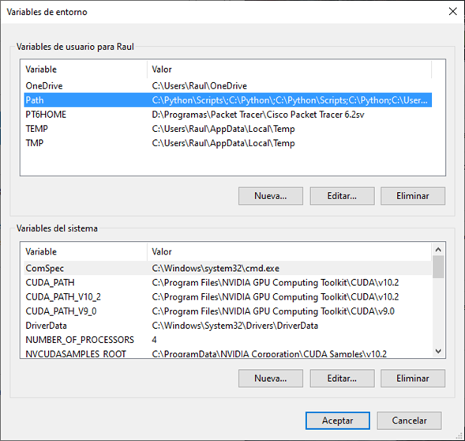
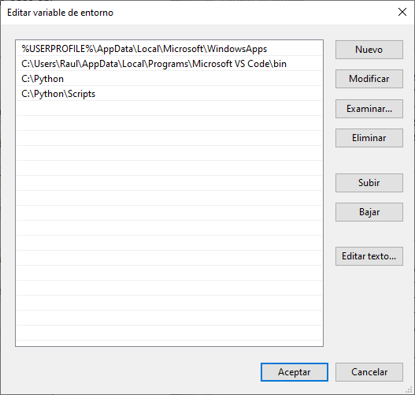
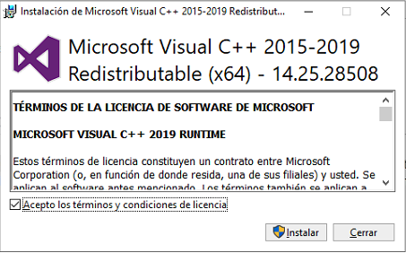

# Recycling project

We're using the code to create a project that uses Python, Tensorflow and Keras. It will distinguish the packaging on a image and it will show you where you have to throw it. 

We've used it to learn how Machine Learning works, and we've commented the code to know how it works line by line.

## Specs

We've tested the model on this specs: 

- OS: Windows 10 Pro
- Processor: Intel® Core™ i7-8750H CPU@220GHz 
- RAM: 16GB
- GPU: NVIDIA GeForce GTX 1060

## Prerequisites

- Download the images dataset
- Install Python 3.8.3
- Install Visual Code Studio
- Install CUDA 10.1
- Add CUDNN 7.6.4
- Install Tensorflow 2.2 and Tensorflow-gpu 2.2
- Install  Pylint 2.5.2
- Install Pillow 7.1.2
- Install Keras 2.3.1

## Training the model

To execute the training model you have to go to "**entrenamiento.py**" and execute it with Python. When it starts, you'll see the epoch processing, seeing on the screen "**Epoch 1/20**".

When it finish to learn, it will show you the results that match with the numeric values. E.g.:

- If the image is a **brick**, it will change the variable "**answer**" to "**0**".
- If the image is **cardboard**, it will change the variable "**answer**" to "**1**".
- If the image is a **tin can**, it will change the variable "**answer**" to "**2**".
- If the image is a **paper**, it will change the variable "**answer**" to "**3**".
- If the image is a **can**, it will change the variable "**answer**" to "**4**".

Our code is limitated to 5 possibilities, but you could change it as you want. **Feel free**. 

At this point it will be created on "**modelo**" folder two files, "**modelo.h5**" and "**pesos.h5**". It contains the parameters that our model needs to predict the images later.

## Testing the model

To execute the prediction you have to go to "predicción.py" file and complete last line on the code with the name of the image that you want to predict (e.g.: If I wanted to predict the "**brick.jpg**" image I'll edit that line with "**predict('brick.jpg')**". Then, execute it with Python. It will predict that is a brick and you have to throw it to the yellow container. 

## Known errors

### My model predicts as a dumb

This model is not perfect, sometimes goes wrong. If you want to improve it, please search more (and different) images and recalculate the values to adjust the learning ratio. The scope of our project is learn how ML works, so although the model sometimes don't match with the reality, we're not going to change it. 

### My PC don't recognize "py" or "pip" commands on CMD:

You have to go to **Control Panel - System** and click on "**Advanced system settings**". Then on "**Environment Variables...**".

Now you have to click on "**Path**", then "**Edit**".

At this point you have to click on "**New**" and copy the path where you've installed Python, and add another where it's the folder "Scripts":

### Executing "train.py" it appears "**ImportError: DLL load failed: The specified module could not be found**":

You have to install Microsoft Visual C++ Redistributable for Visual Studio 2015, 2017 and 2019 ([https://support.microsoft.com/en-us/help/2977003/the-latest-supported-visual-c-downloads](https://github.com/tensorflow/tensorflow/issues/url))

Source: https://github.com/tensorflow/tensorflow/issues/35749

## About Us

We're Raúl Sáinz Fernández and Cristina López López. We're both students of systems and networks on IES Leonardo da Vinci (Madrid).

We're decided to do our final project testing some Machine Learning projects, so here it is our eco-application. 